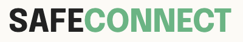
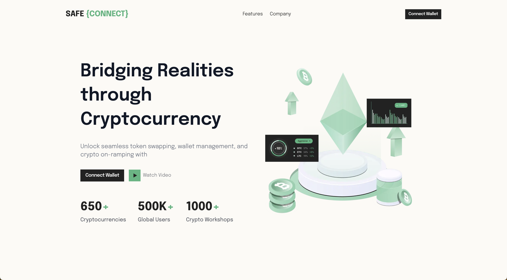
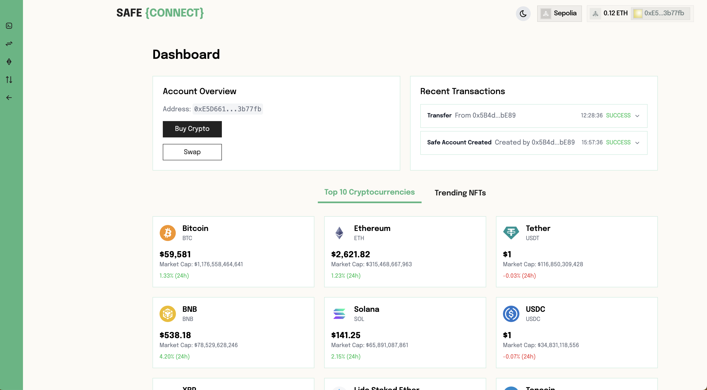
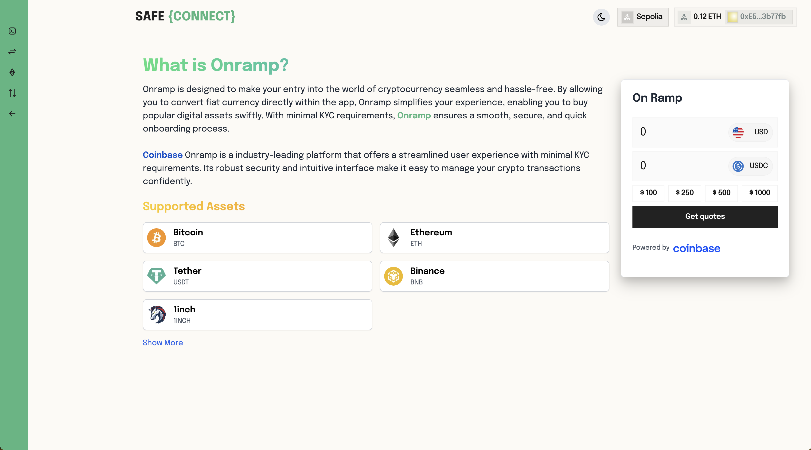

<br>



# SafeConnect

**SafeConnect: Your Secure Gateway to Seamless Crypto Management Across All Chains** 🚀🔐

## Demo

### Landing Page



### Dashboard Page



### Exchange Page



<br>

## 🚀 Get Started

**GitHub Repo**: [Repo Link](https://github.com/satyasandeep007/safeconnect)  
**YouTube Video**: [Demo Video](https://www.youtube.com/watch?v=LvmcrmBSHBc)

## 🛠️ Stack We Used

- Next.js
- WalletConnect
- Tailwind CSS
- Safe Wallet
- CoinGecko API
- 1Inch Swaps
- Coinbase Onramp

## 🏗️ Steps to Run the Project

1. **Clone the repository**

   ```bash
   git clone https://github.com/satyasandeep007/safeconnect
   ```

2. **Install the dependencies**

   ```bash
   pnpm i
   ```

3. **Start the app**

   ```bash
   pnpm dev
   ```

<br>

## 👥 Meet Our Team

<div style="display: flex; justify-content: space-between; align-items: center;">
   <p style="flex:1">Shiva Kumar: </p>
   <div style="flex:4; justify-content: space-between;">
      <a href="https://www.linkedin.com/in/shivamangina/" target="_blank">
      
      </a>
      <a href="https://twitter.com/shivakmangina" target="_blank">
      
      </a>
      <a href="https://www.instagram.com/shiva_mangina" target="_blank">
      
      </a>
      <a href="https://github.com/shivamangina" target="_blank">
      
      </a>
   </div>
</div>

<div style="display: flex; justify-content: space-between; align-items: center;">
   <p style="flex:1">Sandeep Kumar: </p>
   <div style="flex:4; justify-content: space-between;">
      <a href="https://www.linkedin.com/in/satyasandeep" target="_blank">
      
      </a>
      <a href="https://twitter.com/satyasandeep76" target="_blank">
      
      </a>
      <a href="https://www.instagram.com/satyasandeep007" target="_blank">
      
      </a>
      <a href="https://github.com/satyasandeep007" target="_blank">
      
      </a>
   </div>
</div>
